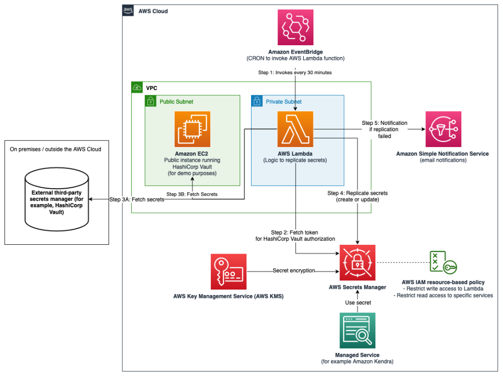
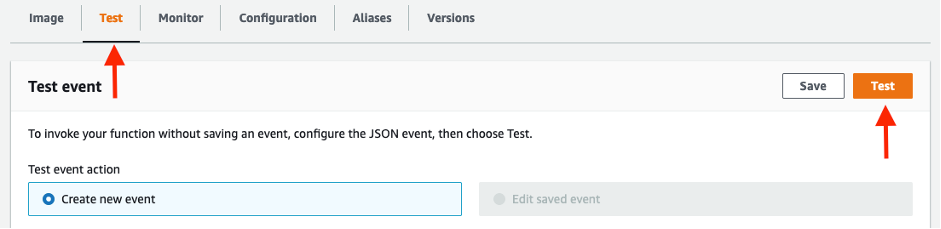
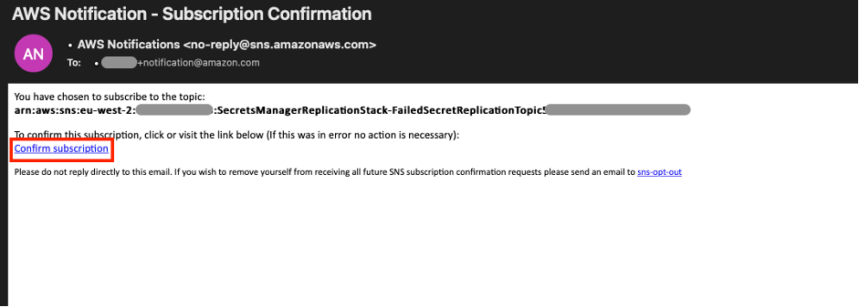

# How to set up continuous replication from your third-party secrets manager to AWS Secrets Manager

This sample shows you how you can use your third-party secrets manager as the source of truth for your secrets, whilst replicating a subset of these secrets to AWS Secrets Manager. By doing this, you will be able to use secrets originating and managed from your third-party secrets manager in AWS Cloud applications or in AWS Services that use Secrets Manager secrets. **This sample uses [HashiCorp Vault](https://www.vaultproject.io/) as third-party secrets manager**.

## DISCLAIMER
The sample code; software libraries; command line tools; proofs of concept; templates; or other related technology (including any of the foregoing that are provided by our personnel) is provided to you as AWS Content under the AWS Customer Agreement, or the relevant written agreement between you and AWS (whichever applies). You should not use this AWS Content in your production accounts, or on production or other critical data. You are responsible for testing, securing, and optimizing the AWS Content, such as sample code, as appropriate for production grade use based on your specific quality control practices and standards. Deploying AWS Content may incur AWS charges for creating or using AWS chargeable resources, such as running Amazon EC2 instances or using Amazon S3 storage.
## Architecture
At its core, this projects contains a [CDK (AWS Cloud Development Kit)](https://aws.amazon.com/cdk/) script which deploys the following:
* An Amazon EC2 instance running an open-source HashiCorp Vault. You will have access the HCP Vault UI running on the instance to add, update and delete secrets
* An initialisation script which sets up the HashiCorp Vault, and adds some sample secrets to it
* An AWS Lambda function which replicates any new or updated secrets from HashiCorp Vault matching a particular prefix to AWS Secrets Manager
* A Cron Job in Amazon EventBridge which triggers the Lambda function periodically (default: every 30 minutes)
* An AWS KMS key for encryption of secrets
* An optional Amazon SNS topic for email notifications if replication fails



## Getting started
### Deploy the solution
Clone this repository:
```bash
git clone https://github.com/aws-samples/aws-secrets-manager-hybrid-secret-replication-from-hashicorp-vault.git SecretsManagerReplication
cd SecretsManagerReplication
```

Open the project in your favorite IDE and open a terminal in the root folder of the project. If your local environment does not have a terminal that allows you to run these commands, consider using [AWS Cloud9](https://docs.aws.amazon.com/cloud9/latest/user-guide/welcome.html) or [AWS CloudShell](https://docs.aws.amazon.com/cloudshell/latest/userguide/welcome.html).

#### Important prerequisites
* You need a valid AWS Access Key ID and Secret Access Key configured, as some of the commands below will interact with your AWS account. See [Configuration basics](https://docs.aws.amazon.com/cli/latest/userguide/cli-configure-quickstart.html) for more details.
* You need to have [Docker Desktop](https://www.docker.com/products/docker-desktop/) installed for the deployment

1. Install CDK v2 by running the following command in your terminal:
```bash
npm install -g aws-cdk
```
1. Verify that you're running CDK version >2.x.x by running:
```bash
cdk --version
```
3. Install dependencies
```bash
npm install
```
4. (optional) Adjust any of the default configurations in `cdk.json`:
   1. `hcpvaultInboundIPCidr`: Default "0.0.0.0/0". Adjust to only allow traffic to your HashiCorp Vault from a specific CIDR range.
   2. `notificationEmail`: Default "". Add an email address to enable email notifications if a replication has failed. Leave as empty string to have no notifications, and don't deploy an Amazon SNS Topic.
   3. `secretsPrefix`: Default "hybrid-aws-secrets". This prefix will be used to identify which secrets should be replicated, adjust to have a custom value for this.
   4. `deployHCPVaultOnEC2`: Default: true. Adjust this boolean value to change whether or not you want to deploy a sample open-source HashiCorp Vault on EC2.
   5. `optionalExternalVaultAddress`: Default: "". If the `deployHCPVaultOnEC2` value is set to `false`, provide an IP address (string) to replicate secrets from an external HashiCorp Vault.
   6. `lambdaCronSchedule`: Default: "cron(0,30 * * * ? *)". Cron expression to trigger the AWS Lambda function periodically following the format defined [here](https://docs.aws.amazon.com/eventbridge/latest/userguide/eb-create-rule-schedule.html)
5. Bootstrap the CDK environment
```bash
cdk bootstrap
```
5. Deploy the CDK project
```bash
cdk deploy
```
Confirm to deploy the solution, and wait for the deployment to finish.
Once done, you should see an output that looks like this:


### Setting up the HashiCorp Vault
If you navigate to the VaultUIAddress which was outputted by the CDK deployment script, you will see the following interface:


You can choose to setup the vault manually, but I recommend running the initialisation script:
```bash
./initialise_vault.sh
```
Note: the setup script requires `jq` to be installed. If you don’t have this yet, check out [this page](https://stedolan.github.io/jq/download/).

Provide the script with the relevant inputs, and you should see the following output the script completed successfully:


Make a note of the Read-only token and the Root token.

In your browser, refresh the HashiCorp Vault UI, and login using the root token:


Navigate through the UI, and you will see that there are a couple of demo secrets automatically created:


And under Policies, you can verify that the Read only token only has permissions to read and list the secrets in the vault under the prefix specified in `cdk.json`:


### Adjusting the vault-connection-secret
In order for the AWS Lambda function to be able to connect to the HashiCorp Vault, it needs the *Read only* vault token which was created by the initialisation script. In the AWS Console, go to `AWS Secrets Manager > Secrets > hybrid-aws-secrets/vault-connection-secret`. Under Secret Value, click on Retrieve Secret Value and then Edit. Update the ‘vaultToken’ value to contain the read-only token:


### Test the replication
You can either wait until 0 minutes or 30 minutes after the hour for the AWS Lambda function to be triggered automatically, or you can trigger it manually from the AWS Console. You can do this by going to AWS Lambda in the console, finding the Secret Replication function (the name starts with “SecretsManagerReplication-SecretReplication”), going to the Test Tab, and clicking the Test button on the right hand side:


If this is the first time the AWS Lambda function ran and the setup was done correctly, you will see that 2 secrets have been replicated, and you can see the secrets from the HashiCorp Vault in AWS Secrets Manager, ready to be used by your AWS applications or AWS Managed Services which integrate with AWS Secrets Manager:


### Updating the secrets
If you want to try out what happens when you update a secret in HashiCorp Vault, you can go to the HashiCorp Vault UI and login using the root token, adjust one of the secrets, and then wait for the AWS Lambda to run to replicate those secrets (or trigger the function manually as explained above). Secrets have a version number - if there's a mismatch between the versions of specific secret in AWS Secrets Manager and HashiCorp Vault, the AWS Lambda function will update the secret.

## Detailed information
This section will dive a bit deeper into some aspects of this solution.
### Replication logic
The following sequence diagram highlights the logic which is implemented in the AWS Lambda function.


There is a reason why the AWS Lambda function is fetching metadata about the secrets, rather than just fetching the secret material from HashiCorp Vault straight away. Typically, secrets don’t update very often. If this AWS Lambda function is called every 30 minutes, then it should not have to add or update any secrets in the majority of invocations. By fetching metadata first, and using that to determine if we need the secret material to create or update secrets, you minimize the number of times secret material is fetched both from HashiCorp Vault and AWS Secrets Manager.

### Setting up email notifications when replication fails
The AWS Lambda function will send an email using Amazon SNS to a designated email address whenever one or more secrets fails to be replicated. To configure this, go to the `cdk.json` file, and ensure that the “notificationEmail” parameter is set to an email address that you own. If necessary, re-run `cdk deploy` to setup an SNS topic and subscribe to any messages put on this topic. Once the deployment has finished, you will get an email to confirm your subscription:


If the SecretReplication Lambda function encounters an error when trying to replicate secrets, it will automatically send an email to this address. Note that the Lambda function will still try to replicate all secrets, even if a previous secret has failed to replicate.


### Scoped down permissions
Due to the sensitive nature of the secrets, it is important that the permissions are scoped down to the least amount required to ensure that there is no inadvertent access to your secrets. In our architecture, there are two main places where we control access to the management of our secrets in Secrets Manager:

#### Lambda execution IAM Role
The IAM Role assumed by the AWS Lambda function during execution contains the appropriate permissions to for secret replication. The setup adopts a least-privilege permission strategy, where only the necessary actions are explicitly allowed on the resources that are required for replication. There is an additional safety measure, which explicitly denies any action to a resource that is not required for the replication. For example, the Lambda will only have permission to publish to the SNS topic that is created for the failed replications, and will explicitly deny a publish to any other topic. Even if someone accidentally adds an allow to the policy for a different topic, the explicit deny will still block this action.

To be specific, the Lambda function has the following permissions:
* ALLOW to List the secrets in AWS Secrets Manager, wildcard “*” as this can’t be scoped down by prefix
* ALLOW to Create, Update and Tag secrets, only if the secret matches the prefix (‘hybrid-aws-secrets’).
* EXPLICIT DENY for actions to any secrets not matching the specific prefix.
* ALLOW to publish to the SNS topic, matching the arn of the FailedReplicationTopic
* EXPLICIT DENY for any SNS actions on SNS topics that are not the FailedReplicationTopic
* ALLOW for Decrypt and GenerateDataKey for the Amazon KMS key used to encrypt the secrets, and decrypt function environment variables.
* EXPLICIT DENY for any KMS actions on resources that are not KMS key used for encryption.

#### KMS Key Policy
When other services need access the replicated secret in AWS Secrets Manager, they need permission to use the ‘hybrid-aws-secrets-encryption-key’ KMS key. You need to allow the principal permissions via the KMS Key Policy as well as provide permission to the principal via an Identity Policy. Refer to [Permissions for AWS services in key policies](https://docs.aws.amazon.com/kms/latest/developerguide/key-policy-services.html) and [Specifying KMS keys in IAM policy statements](https://docs.aws.amazon.com/kms/latest/developerguide/cmks-in-iam-policies.html).

## Possible improvements
1.	Depending on the solution that you’re using, you might have access to different metadata attached to the secrets that you can use to determine if a secret should be updated. For example, if you have access to data representing a ‘last_updated_datetime’ property, you could use this to infer whether or not a secret ought to be updated.
2.	In this sample, I used a static vault token to give the AWS Lambda function access to the HashiCorp Vault. Depending on the solution that you’re using, you might be able to leverage better authentication and authorization mechanisms. For example, HashiCorp Vault allows you to use [IAM auth](https://www.vaultproject.io/docs/auth/aws) using AWS IAM, rather than a static token. This is generally a recommended practice, as this removes the need for static long-lived tokens.
3.	This post addressed the creation of secrets and updating of secrets, but for your production setup, you should also consider deletion of secrets. Depending on your requirements, you can choose to implement a strategy that works best for you to handle secrets in AWS Secrets Manager once the original secret in HashiCorp Vault has been deleted.
4.	In the sample setup, a single KMS key is used to encrypt both the environment variables of the Lambda function, and the secrets in AWS Secrets Manager. You could choose to add an additional KMS Key (which would incur additional cost), to have two separate keys for this. This will allow you to apply more granular permissions for the two keys, but this was deemed out of scope for this sample.

## Cleaning up
To delete the resources that were deployed as part of this script run the following command:
```bash
cdk destroy
```
Please be aware that the S3 bucket and the KMS key deployed as part of the solution are not automatically deleted. You can manually delete these resources using the AWS CLI or the AWS Console.

## Running the automated tests
This project has some pre-defined tests in `test/secrets_manager_replication_blog.test.ts`.
You can run the tests by running the following command in your terminal:
```bash
npm run test
```

## Security

See [CONTRIBUTING](CONTRIBUTING.md#security-issue-notifications) for more information.

## License

This library is licensed under the MIT-0 License. See the LICENSE file.
